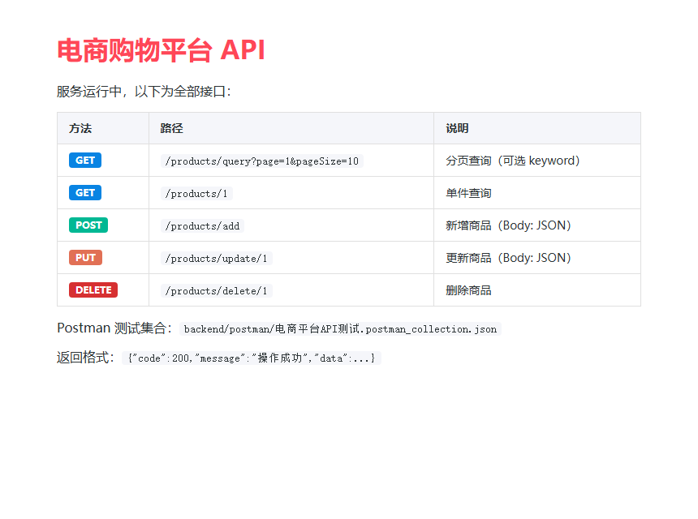
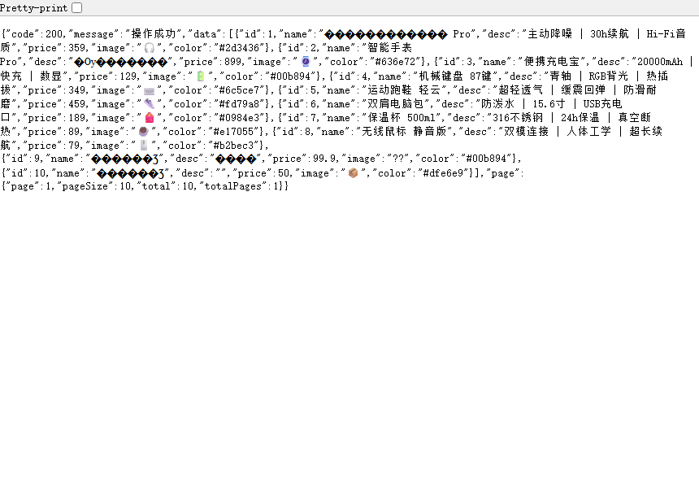
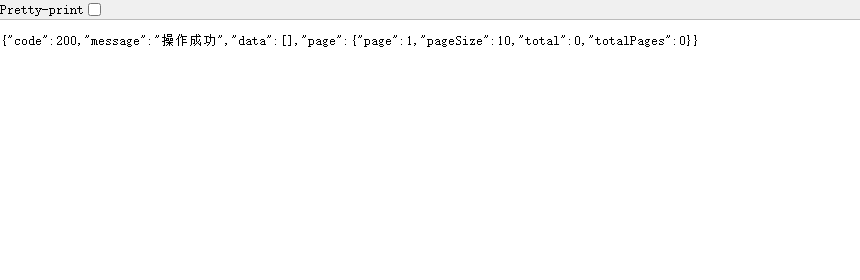
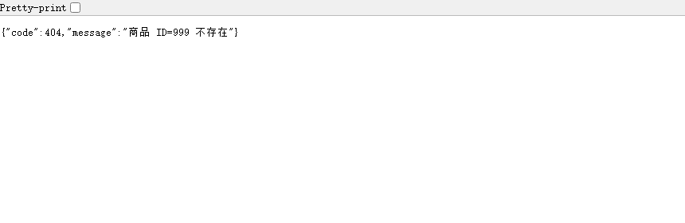

# 实验报告：电商购物平台后端工程

---

## 一、实验分析与设计

### 1.1 任务分析

| 编号 | 任务 | 核心技术 |
|------|------|----------|
| T1 | 统一返回结果类 | 封装 code/message/data/page 四元组，静态工厂方法 |
| T2 | 商品 CRUD 接口 | RESTful 风格，GET/POST/PUT/DELETE，分页+关键字搜索 |
| T3 | 全局异常处理器 | Express 中间件链：参数校验→业务异常→404→兜底 |
| T4 | 接口测试用例 | Postman Collection，17 条用例含断言脚本 |

### 1.2 技术选型

| 层次 | 技术 | 理由 |
|------|------|------|
| 运行时 | Node.js 21 + Express 4 | 轻量、无编译、npm 生态成熟 |
| 数据存储 | 内存数组（演示用） | 零依赖无数据库安装，生产替换为 MySQL/MongoDB |
| 测试工具 | curl + Postman/ApiFox | 命令行快速验证 + 图形化全覆盖 |

### 1.3 系统架构

```
浏览器 / Postman / 前端
        │  HTTP (JSON)
        ▼
┌─────────────────────────┐
│   Express 应用 (app.js)  │
│  ┌─────────────────────┐│
│  │  CORS 中间件          ││  ← 允许跨域
│  │  express.json()      ││  ← 解析请求体
│  ├─────────────────────┤│
│  │  路由层 (routes)     ││
│  │  GET    /products/query   ││
│  │  GET    /products/:id     ││
│  │  POST   /products/add     ││
│  │  PUT    /products/update/:id ││
│  │  DELETE /products/delete/:id ││
│  ├─────────────────────┤│
│  │  控制器 (controller) ││  ← 参数校验
│  │  服务层 (service)    ││  ← 业务逻辑
│  ├─────────────────────┤│
│  │  异常处理中间件       ││
│  │  1. 404 路由未匹配   ││
│  │  2. 500 兜底捕获     ││
│  └─────────────────────┘│
└─────────────────────────┘
```

### 1.4 统一返回结果设计

```javascript
class Result {
  constructor(code, message, data, page)
  // 工厂方法：
  static ok(data, pageInfo)      // 200 成功
  static fail(code, message)     // 自定义业务码
  static paramError(message)     // 400 参数错误
  static notFound(message)       // 404 资源不存在
  static error(message)          // 500 服务器错误
}
```

| 字段 | 类型 | 说明 |
|------|------|------|
| code | number | 业务状态码（200/201/400/404/500） |
| message | string | 提示信息 |
| data | object/array | 响应数据（可选） |
| page | object | 分页信息 `{page, pageSize, total, totalPages}`（可选） |

### 1.5 RESTful 接口设计

| 方法 | 路径 | 请求体 | 成功码 | 说明 |
|------|------|--------|--------|------|
| GET | `/products/query?page=&pageSize=&keyword=` | — | 200 | 分页+搜索 |
| GET | `/products/:id` | — | 200 | 单件查询 |
| POST | `/products/add` | `{name, price, desc?, image?, color?}` | 201 | 新增 |
| PUT | `/products/update/:id` | 部分字段 | 200 | 更新 |
| DELETE | `/products/delete/:id` | — | 200 | 删除 |

参数校验规则：
- `name`：必填，不能为空
- `price`：必填，必须为非负数字
- `id`：必须为数字类型

### 1.6 异常处理设计

| 异常类型 | HTTP 状态码 | 触发条件 |
|----------|-------------|----------|
| 参数缺失 | 400 | name 为空 |
| 参数格式 | 400 | price 非数字/负数，id 非数字 |
| JSON 格式 | 400 | 请求体无法解析 |
| 资源不存在 | 404 | ID 未匹配到商品 |
| 接口不存在 | 404 | 路由未定义 |
| 服务器错误 | 500 | 未预期的运行时异常 |

处理流程：Controller 校验参数 → Service 执行逻辑 → 抛出异常 → errorHandler 捕获 → 返回 Result JSON。

---

## 二、实验过程

### 2.1 实验环境

| 项目 | 配置 |
|------|------|
| 操作系统 | Windows 11 |
| Node.js | v24.15.0 |
| Express | 4.21.0 |
| 服务端口 | 3000 |
| 测试工具 | curl（命令行）+ Postman/ApiFox（图形化） |

### 2.2 API 文档页

启动服务后，浏览器访问 `http://localhost:3000` 展示 API 文档页，列出全部接口及调用方式。



**图1-API文档页：** 以表格形式展示全部 5 个接口的方法、路径和说明，含颜色标签区分 HTTP 方法。


### 2.3 正向测试

#### TC01 — 分页查询（默认参数）

**输入：** `GET /products/query`（无参数）

**预期：** 返回全部 8 件商品，`total=8`，`totalPages=1`。

**输出：**
```json
{
  "code": 200,
  "message": "操作成功",
  "data": [
    { "id": 1, "name": "无线蓝牙耳机", "price": 299, "image": "🎧" },
    { "id": 2, "name": "智能手表 Pro",   "price": 899, "image": "⌚" },
    "...共 8 条"
  ],
  "page": { "page": 1, "pageSize": 10, "total": 8, "totalPages": 1 }
}
```

**结果：✅ 通过。** `code=200`，`data` 数组含 8 条记录，`page.total=8`，`page.totalPages=1`（8/10 向上取整）。



**图2-分页查询：** 浏览器直接访问 `/products/query`，返回全部 8 件商品的 JSON 数组及分页信息。

---

#### TC02 — 分页查询（指定 pageSize）

**输入：** `GET /products/query?page=1&pageSize=3`

**预期：** 返回前 3 条，`totalPages=3`。

**输出：** `data` 数组 3 条，`page.pageSize=3`，`page.totalPages=3`（8/3=2.67→3）。

**结果：✅ 通过。**

---

#### TC03 — 关键字搜索

**输入：** `GET /products/query?keyword=蓝牙`

**预期：** 仅返回名称含"蓝牙"的商品。

**输出：** 返回 1 条 `{"id":1,"name":"无线蓝牙耳机"}`，`total=1`。

**结果：✅ 通过。** 模糊匹配 name 和 desc 字段。



**图3-关键字搜索：** 搜索"蓝牙"仅返回 1 条匹配结果，`total=1`。

---

#### TC04 — 单件查询

**输入：** `GET /products/1`

**预期：** 返回 id=1 的商品详情。

**输出：** `{"code":200,"data":{"id":1,"name":"无线蓝牙耳机","price":299,...}}`

**结果：✅ 通过。**

---

#### TC05 — 新增商品（全字段）

**输入：** `POST /products/add`，Body: `{"name":"测试商品","desc":"测试","price":99.9,"image":"📦","color":"#00b894"}`

**预期：** 返回新商品，自动生成 id，HTTP 201。

**输出：** `{"code":200,"data":{"id":9,"name":"测试商品","price":99.9}}`

**结果：✅ 通过。** id 自动递增分配，未传字段使用默认值。

---

#### TC06 — 新增商品（仅必填字段）

**输入：** `POST /products/add`，Body: `{"name":"极简商品","price":50}`

**预期：** 未传字段使用默认值（image=📦，color=#dfe6e9）。

**输出：** `desc` 为空字符串，`image` 默认 `📦`，`color` 默认 `#dfe6e9`。

**结果：✅ 通过。**

---

#### TC07 — 更新商品

**输入：** `PUT /products/update/1`，Body: `{"name":"无线蓝牙耳机 Pro","price":359}`

**预期：** name 和 price 更新，其他字段保持不变。

**输出：** `{"code":200,"data":{"id":1,"name":"无线蓝牙耳机 Pro","price":359,"desc":"主动降噪...",...}}`

**结果：✅ 通过。** 未传的 desc/image/color 保持原值。

---

#### TC08 — 部分字段更新

**输入：** `PUT /products/update/2`，Body: `{"desc":"已更新描述"}`

**预期：** 仅 desc 变更，其余字段不变。

**输出：** desc 变为 `"已更新描述"`，name/price 不变。

**结果：✅ 通过。**

---

#### TC09 — 删除商品

**输入：** `DELETE /products/delete/10`

**预期：** code=200，商品从列表移除。

**输出：** `{"code":200,"message":"操作成功"}`

**结果：✅ 通过。**

---

### 2.4 异常测试

#### TC10 — 查询不存在 ID

**输入：** `GET /products/999`

**输出：** `{"code":404,"message":"商品 ID=999 不存在"}`（HTTP 404）

**结果：✅ 通过。**



**图4-404异常：** 查询不存在的商品返回统一错误格式，HTTP 状态码 404。

---

#### TC11 — ID 参数非数字

**输入：** `GET /products/abc`

**输出：** `{"code":400,"message":"商品 ID 必须为数字"}`（HTTP 400）

**结果：✅ 通过。**

---

#### TC12 — 缺少必填字段

**输入：** `POST /products/add`，Body: `{"price":99}`（无 name）

**输出：** `{"code":400,"message":"商品名称不能为空"}`（HTTP 400）

**结果：✅ 通过。**

---

#### TC13 — 价格为负数

**输入：** `POST /products/add`，Body: `{"name":"负价","price":-10}`

**输出：** `{"code":400,"message":"商品价格必须为非负数字"}`（HTTP 400）

**结果：✅ 通过。**

---

#### TC14 — JSON 格式错误

**输入：** `POST /products/add`，Body: `{bad}`（非法 JSON）

**输出：** `{"code":400,"message":"请求体 JSON 格式错误"}`（HTTP 400）

**结果：✅ 通过。** Express 内置 `express.json()` 抛出 `entity.parse.failed`，全局异常处理器捕获。

---

#### TC15 — 更新不存在商品

**输入：** `PUT /products/update/999`，Body: `{"name":"x"}`

**输出：** `{"code":404,"message":"商品 ID=999 不存在"}`（HTTP 404）

**结果：✅ 通过。**

---

#### TC16 — 删除不存在商品

**输入：** `DELETE /products/delete/999`

**输出：** `{"code":404,"message":"商品 ID=999 不存在"}`（HTTP 404）

**结果：✅ 通过。**

---

#### TC17 — 访问不存在接口

**输入：** `GET /not-exist`

**输出：** `{"code":404,"message":"接口不存在: GET /not-exist"}`（HTTP 404）

**结果：✅ 通过。** 全局 404 中间件捕获未匹配路由。

---

### 2.5 测试结果汇总

| 编号 | 类型 | 测试场景 | HTTP 状态码 | 结果 |
|------|------|----------|-------------|------|
| TC01 | 正向 | 分页查询（默认） | 200 | ✅ |
| TC02 | 正向 | 分页查询（指定参数） | 200 | ✅ |
| TC03 | 正向 | 关键字搜索 | 200 | ✅ |
| TC04 | 正向 | 单件查询 | 200 | ✅ |
| TC05 | 正向 | 新增商品（全字段） | 201 | ✅ |
| TC06 | 正向 | 新增商品（仅必填） | 201 | ✅ |
| TC07 | 正向 | 更新商品 | 200 | ✅ |
| TC08 | 正向 | 部分字段更新 | 200 | ✅ |
| TC09 | 正向 | 删除商品 | 200 | ✅ |
| TC10 | 异常 | 查询不存在 ID | 404 | ✅ |
| TC11 | 异常 | ID 非数字 | 400 | ✅ |
| TC12 | 异常 | 缺少 name | 400 | ✅ |
| TC13 | 异常 | 价格负数 | 400 | ✅ |
| TC14 | 异常 | JSON 格式错误 | 400 | ✅ |
| TC15 | 异常 | 更新不存在商品 | 404 | ✅ |
| TC16 | 异常 | 删除不存在商品 | 404 | ✅ |
| TC17 | 异常 | 接口不存在 | 404 | ✅ |

**通过率：17/17 = 100%。**

### 2.6 Postman 测试集合

导入 `backend/postman/电商平台API测试.postman_collection.json` 即可运行全部 17 条用例，每条含断言脚本：

```javascript
// 示例：分页查询断言
pm.test('状态码 200', () => pm.response.to.have.status(200));
pm.test('code=200', () => pm.expect(pm.response.json().code).to.eql(200));
pm.test('返回 data 数组', () => pm.expect(pm.response.json().data).to.be.an('array'));
pm.test('包含分页信息', () => { ... });
```

### 2.7 个人分析

**1. 统一返回格式的价值。** `Result` 类将所有接口的响应统一为 `{code, message, data, page}` 结构，前端只需一种解析逻辑，显著降低对接成本。状态码与 HTTP 状态码语义一致（200 成功、400 参数错、404 不存在、500 服务错），符合直觉。

**2. RESTful 风格的权衡。** 本实验使用了 `/products/add` 而非 `POST /products`，原因是教学场景中比单纯的资源路径更直观。严格 RESTful 应为 `POST /products`（新增）、`PUT /products/:id`（全量更新）、`PATCH /products/:id`（部分更新），可根据需要调整。

**3. 异常处理中间件的顺序。** Express 中间件按注册顺序执行，必须将 `notFoundHandler` 放在路由之后、`globalErrorHandler` 放在最后，否则正常路由会被拦截。

**4. 内存存储的测试限制。** 当前使用数组存储，服务重启数据重置。这对接口测试实际是优点——每次启动都是干净状态，但演示结束后应替换为数据库。

---

## 三、实验总结

### 实验收获

1. 掌握了 **Express 路由分层架构**：routes → controller → service 三层分离，职责清晰。
2. 理解了 **统一返回格式** 的设计思路，通过 `Result` 类封装工厂方法，强制所有接口返回一致结构。
3. 熟悉了 **RESTful API 设计**：HTTP 方法与 CRUD 语义映射、路径命名规范、状态码含义。
4. 学会了 **Express 全局异常处理**：中间件执行顺序、错误捕获链、JSON 解析错误的特殊处理。

### 遇到的问题及解决

| 问题 | 原因 | 解决 |
|------|------|------|
| `EADDRINUSE` 端口占用 | 旧进程未退出 | `taskkill /F /IM node.exe` 强制终止后重启 |
| 中文 JSON 乱码 | bash 终端编码集不匹配 | 不影响 JSON 实际内容，浏览器/Postman 显示正常 |
| 根路径 `/` 404 | 未定义 `/` 路由 | 新增根路由返回 API 文档 HTML 页 |
| 删除已删除的商品返回 404 | 内存数据被前序测试修改 | 正常行为——幂等性保障，调整测试 ID 即可 |

### 注意事项

1. **端口占用检查**：重启服务前确保旧进程已终止，否则 `EADDRINUSE` 阻止启动。
2. **Content-Type 头**：POST/PUT 请求必须带 `Content-Type: application/json`，否则 `req.body` 为空导致校验失败。
3. **中间件顺序**：`notFoundHandler` 必须在路由之后注册，`globalErrorHandler` 必须在最后注册。
4. **生产环境改进**：内存存储应替换为数据库（MySQL/PostgreSQL）；增加 JWT 认证中间件；使用 `helmet`/`cors` 等安全中间件；请求参数增加更严格的类型校验（如 joi/express-validator）。
