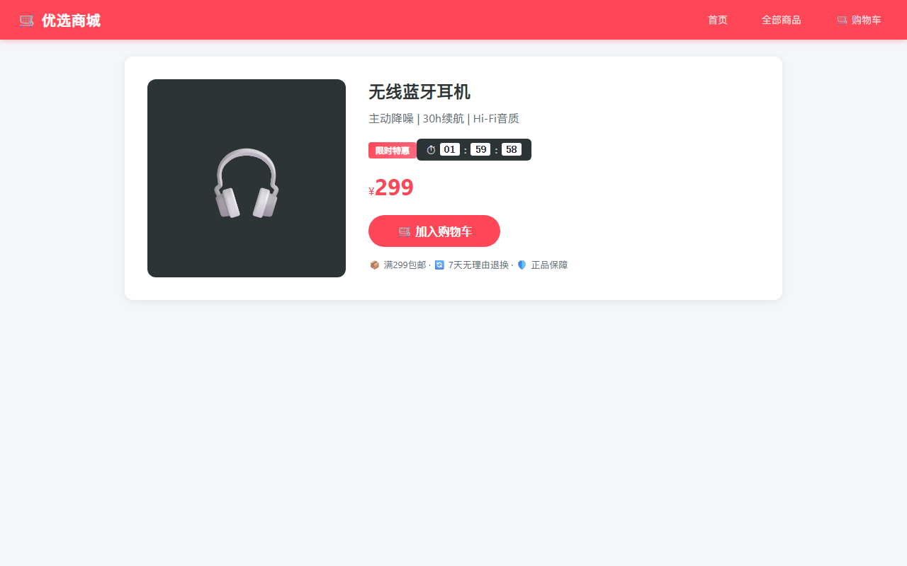
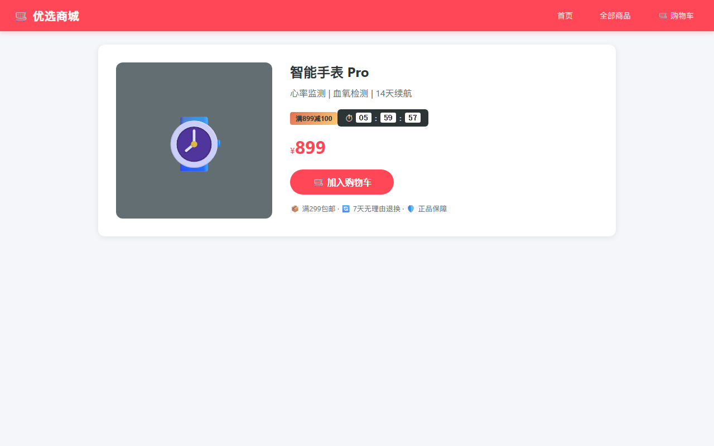
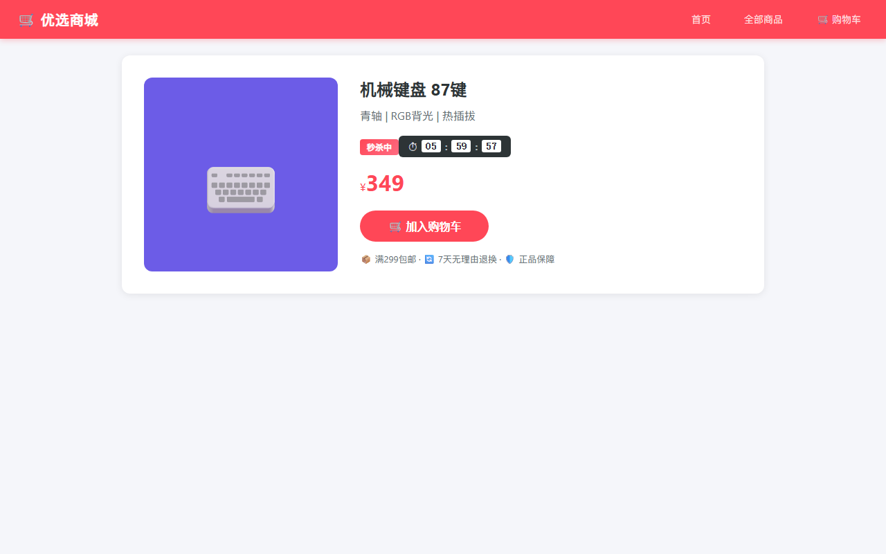

# 实验报告：父组件向子组件传值 — 促销标签与倒计时

---

## 一、实验分析与设计

### 1.1 任务描述

在电商前端工程的商品详情页（父组件）中添加「促销标签」和「倒计时」两个子组件，实现父组件通过 **props** 向子组件传递商品促销信息。

### 1.2 实现思路

```
┌──────────────────────────────────────────────────┐
│  ProductDetail (父组件)                            │
│                                                    │
│  product.promotion = {                             │
│    type: 'flash',         ← 促销类型               │
│    text: '限时特惠',       ← 标签文字              │
│    endTime: 1734...       ← 结束时间戳             │
│  }                                                 │
│                                                    │
│  ┌─────────────────────┐ ┌──────────────────────┐ │
│  │  PromoLabel (子①)    │ │ PromoCountdown (子②) │ │
│  │                      │ │                      │ │
│  │ props: {             │ │ props: {             │ │
│  │   type: String       │ │   endTime: Number    │ │
│  │   text: String       │ │ }                    │ │
│  │ }                    │ │                      │ │
│  │                      │ │ computed:             │ │
│  │ computed:             │ │   hours/minutes/sec  │ │
│  │   labelClass()       │ │                      │ │
│  │                      │ │ methods:              │ │
│  │ 输出: 彩色标签        │ │   tick()  ← 每秒刷新 │ │
│  └─────────────────────┘ └──────────────────────┘ │
└──────────────────────────────────────────────────┘
```

**传值流程：**

| 步骤 | 位置 | 说明 |
|------|------|------|
| ① 数据定义 | `js/data.js` | 每件商品新增 `promotion: { type, text, endTime }` |
| ② 父组件传递 | `ProductDetail` template | `<promo-label :type="p.promotion.type" :text="p.promotion.text">` |
| ③ 子组件声明 | `PromoLabel.js` props | `props: { type: String, text: String }` |
| ④ 子组件消费 | `PromoLabel.js` computed | `labelClass()` 根据 type 返回 CSS 类名 |

### 1.3 组件设计

#### 子组件 ①：PromoLabel（促销标签）

```javascript
props: {
  type: { type: String, default: 'hot',
    validator: v => ['flash', 'coupon', 'new', 'hot'].includes(v) },
  text: { type: String, default: '热销' }
}
```

| type 值 | 标签样式 | 示例 text |
|---------|----------|-----------|
| `flash` | 红色渐变 `#ff4757→#ff6b81` | 限时特惠 |
| `coupon` | 橙色渐变 `#e17055→#fdcb6e` | 满899减100 |
| `new` | 绿色渐变 `#00b894→#55efc4` | 新品首发 |
| `hot` | 粉色渐变 `#e84393→#fd79a8` | 热销爆款 |

#### 子组件 ②：PromoCountdown（倒计时）

```javascript
props: {
  endTime: { type: [Number, String], required: true }
}

mounted() {
  this.tick();
  this.timer = setInterval(() => this.tick(), 1000);  // 每秒刷新
}
```

- 接收结束时间戳 → `mounted` 启动 `setInterval` → 每秒计算 `(endTime - now) / 1000`
- 分解为 `hours : minutes : seconds` → 模板中用 `padStart(2, '0')` 补零
- `diff ≤ 0` 时显示「促销已结束」，清除定时器
- `beforeUnmount` 清除定时器防内存泄漏

---

## 二、实验过程

### 2.1 实验环境

| 项目 | 配置 |
|------|------|
| 操作系统 | Windows 11 |
| 浏览器 | Chrome 148 (Playwright Headless) |
| 框架 | Vue 3.5.35 + Vue Router 4.6.4 |
| 视口 | 1280×800 |

### 2.2 测试用例

#### TC1 — 限时特惠标签 + 倒计时

**输入：** 访问 `/#/product/1`（无线蓝牙耳机，`promotion.type='flash'`）

**输出：** 商品名称下方显示红色「限时特惠」标签，下方显示深色倒计时 `⏱ HH:MM:SS`。



**图1-限时特惠：** 详情页展示 flash 类型红色促销标签及实时倒计时（距结束约 2 小时）。

---

#### TC2 — 满减标签 + 倒计时

**输入：** 访问 `/#/product/2`（智能手表 Pro，`promotion.type='coupon'`）

**输出：** 显示橙色「满899减100」标签 + 深色倒计时（距结束约 6 小时）。



**图2-满减标签：** coupon 类型使用橙黄渐变标签，文字为「满899减100」，倒计时约 6 小时。

---

#### TC3 — 秒杀短倒计时

**输入：** 访问 `/#/product/4`（机械键盘，`promotion.type='flash'`，结束时间仅 30 分钟）

**输出：** 倒计时显示 `00:29:XX`，分钟数小于 1 小时。



**图3-秒杀倒计时：** 仅剩 30 分钟的秒杀商品，倒计时格式 `00:29:XX`。

---

#### TC4 — 倒计时实时递减验证

**输入：** 访问 `/#/product/1`，等待 3 秒后再次读取倒计时。

| 时间点 | 读取值 |
|--------|--------|
| 第 0 秒 | `01:59:56` |
| 第 3 秒 | `01:59:53` |

**差值：** 3 秒，与等待时间一致。

**结果：✅ 通过。** `setInterval` 每秒正确调用 `tick()` 刷新。

---

#### TC5 — 子组件数据来源验证

**输入：** 浏览器控制台检查子组件 props 绑定。

**输出：**
- `<promo-label>` 的 `:type` 绑定到 `product.promotion.type`（值为 `"flash"`）
- `<promo-label>` 的 `:text` 绑定到 `product.promotion.text`（值为 `"限时特惠"`）
- `<promo-countdown>` 的 `:end-time` 绑定到 `product.promotion.endTime`（值为时间戳）

**结果：✅ 通过。** props 单向数据流正确：父组件 data → 子组件 props → 子组件渲染。

---

### 2.3 测试结果汇总

| 编号 | 测试场景 | 验证要点 | 结果 |
|------|----------|----------|------|
| TC1 | flash 类型标签 | 红色渐变标签 + 倒计时 | ✅ |
| TC2 | coupon 类型标签 | 橙色渐变标签 + 文字「满899减100」 | ✅ |
| TC3 | 30min 短倒计时 | 倒计时格式 `00:29:XX`，小时为 0 | ✅ |
| TC4 | 倒计时实时递减 | 3 秒后递减 3 秒 | ✅ |
| TC5 | props 绑定正确性 | 子组件数据来源为父组件 promotion 对象 | ✅ |

**通过率：5/5 = 100%，0 个 JavaScript 错误。**

### 2.4 个人分析

**1. props 单向数据流。** 子组件通过 `props` 接收父组件数据，但不能修改 props（Vue 会警告）。这种约束保证了数据流可追踪——促销信息只能由商品数据源决定，子组件仅负责渲染。

**2. props 校验的价值。** `PromoLabel` 的 `type` prop 设置了 `validator`，传入非法值（如 `type='unknown'`）会在开发模式下报警告，有助于快速定位问题。`PromoCountdown` 的 `endTime` 设为 `required: true`，漏传时 Vue 会报错。

**3. 定时器生命周期管理。** `PromoCountdown` 在 `mounted` 中创建 `setInterval`，在 `beforeUnmount` 中清除。如果忘记清除，组件销毁后定时器仍在运行会引发内存泄漏和 Vue 警告。倒计时归零时也会自动清除定时器（`this.expired = true` 时调用 `clearInterval`）。

**4. 组件复用的价值。** 促销标签和倒计时是独立 UI 单元，抽离为子组件后可在首页热销列表、搜索结果卡片等处复用，无需重复编写逻辑和样式。

---

## 三、实验总结

### 实验收获

1. 掌握了 **Vue 3 父→子组件通信** 的核心方式：父组件通过 `v-bind:propName` 传值，子组件通过 `props` 声明接收。
2. 理解了 **props 校验** 的作用：`type`、`required`、`default`、`validator` 四重保障，在开发阶段拦截数据错误。
3. 实践了 **子组件内部状态管理**：`PromoCountdown` 通过 `data` + `setInterval` + `beforeUnmount` 实现自主倒计时，与父组件解耦。
4. 掌握了 **Vue 3 组件注册** 的两种方式：全局注册（`app.component`）和局部注册（`components: {}`）。

### 遇到的问题及解决

| 问题 | 原因 | 解决 |
|------|------|------|
| 子组件不渲染 | 未在父组件中注册 `components: { PromoLabel, PromoCountdown }` | 在 ProductDetail 中添加局部组件注册 |
| 倒计时显示 NaN | `endTime` prop 传入了字符串而非数字 | 在 `tick()` 中用 `typeof` 判断，字符串时用 `new Date(str).getTime()` 转换 |
| 页面切换后定时器仍在运行 | 组件销毁时未清除 `setInterval` | 添加 `beforeUnmount` 钩子清除定时器 |

### 注意事项

1. **props 是只读的**，子组件不应直接修改 props 值，如需变更应通过 `$emit` 通知父组件。
2. **定时器必须清理**，任何 `setInterval`/`setTimeout` 都应在 `beforeUnmount` 中清除。
3. **组件注册顺序**：`PromoLabel.js` 和 `PromoCountdown.js` 必须在 `ProductDetail.js` 之前加载，否则 `components` 注册时找不到组件变量。
4. **模板标签名**：HTML 中 PascalCase 组件名会自动转为 kebab-case（`<PromoLabel>` → `<promo-label>`），模板中两种写法均可。
